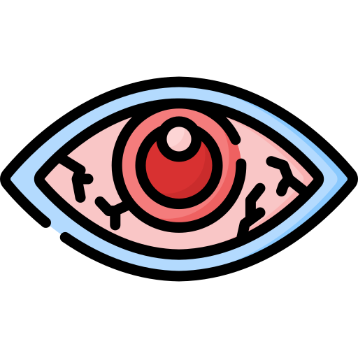
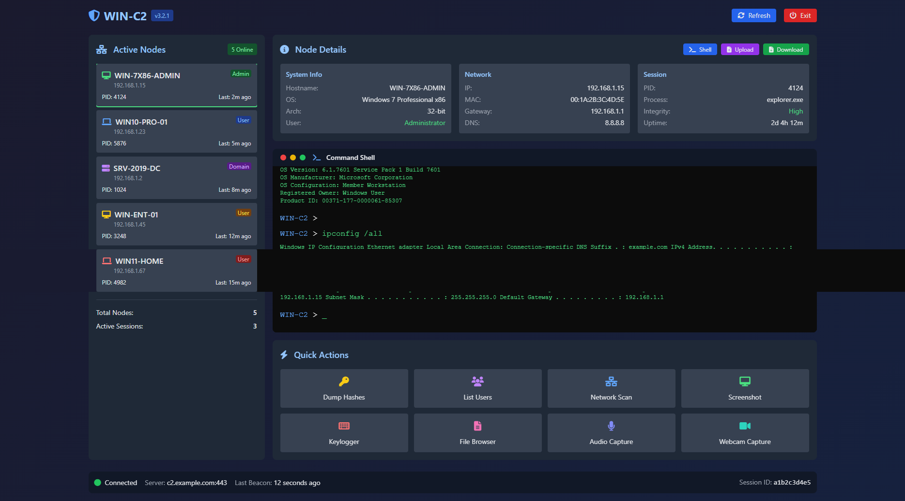

<h3 align="center"></h3>

    <b>RedVision</b> 
    

  <b>collection of custom-designed HTML user interfaces for Command & Control (C2) systems.</b>
    

# Templates

> All HTML Files In  template Folder

`c2_0.html` 

  

   

  

<h2 id="next-update">🔱 Next Update</h2>
<ul>
<li>Add More Template !</li>
</ul>
<h2 id="contact">📧 Contact</h2>

## ⚠️ Legal & Ethical Disclaimer

🚨 This tool is developed strictly for educational and authorized security testing purposes only.

🔬 It is intended to help cybersecurity professionals, researchers, and enthusiasts understand post-exploitation, red teaming, and detection techniques in lab or controlled environments.

❌ Do NOT use this tool on any system or network without explicit permission. Unauthorized use may be illegal and unethical.

🛡 The author takes no responsibility for any misuse or damage caused by this project.

---
